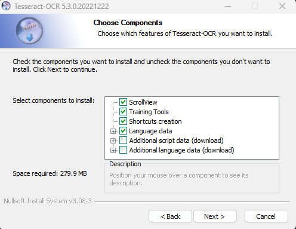
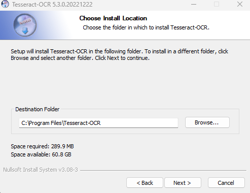
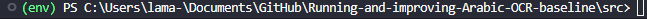
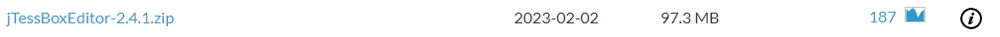

# Running-and-improving-Arabic-OCR-baseline
This repository is created to try to improve the result of tessaract OCR for Arabic using image pre-processing methods
## Content
[About](#about) 

[How to run](#how) 

[Traning](#traning) 


<a name="about"/>

## About

In this project, I used [tessaract OCR](https://github.com/tesseract-ocr/tesseract#about) and did some image pre-processing as recommended by tessaract [documentation](https://tesseract-ocr.github.io/tessdoc/ImproveQuality.html) to improve the results produced by the model I also included a training file with synthetic data produced using [TextRecognitionDataGenerator](https://github.com/Belval/TextRecognitionDataGenerator) repository to train the model in it to further improve the results for especially the Arabic language 
<a name="how"/>
## How to run 

You should start off by downloading the tessaract engine from their [official website](https://tesseract-ocr.github.io/tessdoc/Installation.html) and should follow the steps for your operating system 

During installation, you will be presented with same as the image below it allows you to add more components. Arabic should be included in the Additional language and script data.



also, remember the location of this folder of the image below since we are going to use it in our code later and if you are a windows user it is prefered to not change it so you do not have to change the code later.



after the installation is completed create clone the current repository by 

```
git clone https://github.com/Lama-Alsaif/Running-and-improving-Arabic-OCR-baseline.git
```

then open it up with your favorite editor and go to ```src/main.py``` 
and change the location of ```pytesseract.pytesseract.tesseract_cmd ``` variable to the location you have installed tessaract OCR in 
(if you are a windows user and kept it in its default location you can skip this step)

when you are done with this step I would recommend creating a venv environment by going to the repository path and opening up the terminal type 

```
python -m venv env
```
this creates an env folder where the new environment will be stored 

then type

``` 
&env/Scripts/Activate.ps1
```

or if the above command did not work type

```
env/Scripts/activate.bat
```
this will activate the evnviorment and you should see the (env) at the begging of your commend line, like the picture below 



finally type  
```
 pip install -r requirements.txt
```
to download all the required libraries including pytesseract which is used to link tesseract with python

the last step now is to  run ```main.py``` 

<a name="traning"/>

## Traning 

1-To train images on the tessaract OCR model we first have to change the image to a box file we will have to download  a tool called [jTessBoxEditor](https://sourceforge.net/projects/vietocr/files/jTessBoxEditor/) download the version in the screen shotbelow 

unzip the file and open up the train.bat 

2-create a box file 
Syntax: tesseract [langname].[fontname].[expN].[file-extension] [langname].[fontname].[expN] batch.nochop makebox
Eg:tesseract train.my.exp0.tif train.my.exp0 batch.nochop makebox

3-Create .tr file (Compounding image file and box file)
Syntax: tesseract [langname].[fontname].[expN].[file-extension] [langname].[fontname].[expN] box.train
Eg: tesseract train.my.exp.tif train.my.exp0 box.train

4-Extract the charset from the box files (Output for this command is unicharset file)
Syntax: unicharset_extractor [langname].[fontname].[expN].box 
Eg: unicharset_extractor train.my.exp0.box

5-Create a font_properties file based on our needs.
Syntax: echo "[fontname] [italic (0 or 1)] [bold (0 or 1)] [monospace (0 or 1)] [serif (0 or 1)] [fraktur (0 or 1)]" [angle bracket should be here] font_properties 
Eg: echo "arial 0 0 1 0 0" [angled bracket] font_properties

6-Training the data.
Syntax: mftraining -F font_properties -U unicharset -O [langname].unicharset [langname].[fontname].[expN].tr
Eg: mftraining -F font_properties -U unicharset -O train.unicharset train.my.exp0.tr

7-Syntax: cntraining [langname].[fontname].[expN].tr
Eg: cntraining train.my.exp0.tr
{*Note:After step 5 and step 6 four files were created.(shapetable,inttemp,pffmtable,normproto) }

8-Rename four files (shapetable,inttemp,pffmtable,normproto) into ([langname].shapetable,[langname].inttemp,[langname].pffmtable,[langname].normproto)
Syntax: rename filename1 filename2
Eg:
    rename shapetable train.shapetable
    rename inttemp train.inttemp
    rename pffmtable train.pffmtable
    rename normproto train.normproto
    
9-Create .traineddata file
Syntax: combine_tessdata [langname].
Eg: combine_tessdata train.

finally 
Move .traineddata file to tesseract programs tessdata directory or where you saved your tesseract model at
C:\Program Files\Tesseract-OCR\tessdata


Run tesseract for trained fronts

these steps are taken from this [link](https://www.youtube.com/watch?v=1v8BPw0Dn0I&ab_channel=TheCode) 
